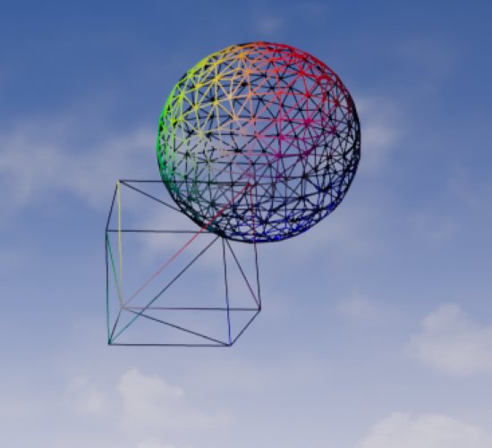
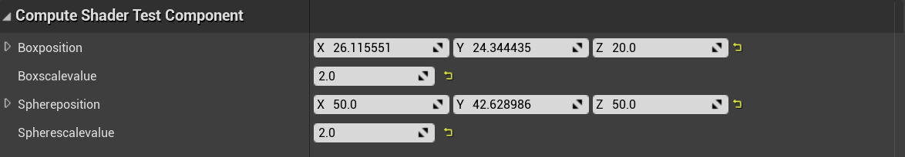
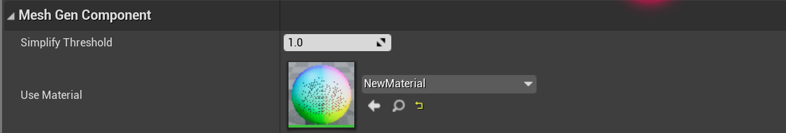

# isosurafce reconstruct

## method

dual contouring

## main reference code

* https://github.com/Colt-Zero/DualContouringGPU
* https://github.com/nickgildea/DualContouringSample

## main component

* computeshadertestcomponent: 
* * control the compute shader pass 
* * output is the vertex position
* meshgencompoennt:
* * control the generation of mesh
* * get the vertex position from previous component and build octree to gen the index of mesh

## result

## profile

test platform:
* rtx3060 12g
* i7-10700
* 32g 2933mhz

|date|compute shader|mesh gen|data range|vertex num|triangle num|simplify|
|---|---|---|---|---|---|---|
|7.8|4|12|32 * 32 * 32|-|-|-|
|7.14|11|9|128 * 128 * 128|6200|12000|no|
|7.15|7|9|128 * 128 * 128|6200|12000|no|
|7.26|1|3|128 * 128 * 128|313|636|yes|
|7.26|1|8|128 * 128 * 128|6200|12000|no|

### optimize log

#### 7.13
* 解决octree生命周期中的内存泄露问题
* 采用自底向上的构建方法减少octree构建时间
* 将compute shader 进行重构，从而减少计算qef部分的时间开销

#### 7.14
* 实时更新rwbuffer的size取代初始值，减少通信bandwith开销

#### 7.15
* 修改rwbuffer的size更新策略，减少rwbuffer创建开销

#### 7.20
* 加入了减面功能

#### 7.26
* 通过进行预先筛选减少cpugpu通信开销

